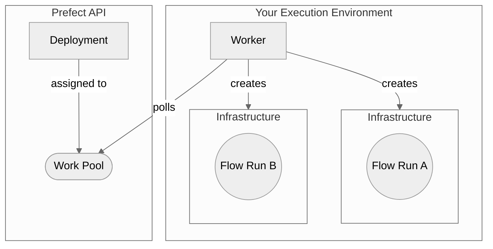

Workers are lightweight polling services that retrieve scheduled runs from a work pool and execute them.

Workers each have a type corresponding to the execution environment to submit flow runs to.
Workers can only poll work pools that match their type.
As a result, when deployments are assigned to a work pool, you know in which execution environment scheduled flow runs for that deployment will run.

The following diagram summarizes the architecture of a worker-based work pool deployment:



The worker is in charge of provisioning the _flow run infrastructure_.   

### Worker types

Below is a list of available worker types. Most worker types require installation of an additional package.

| Worker Type | Description | Required Package |
| --- | --- | --- |
| [`process`](https://prefect-python-sdk-docs.netlify.app/prefect/workers/process/) | Executes flow runs in subprocesses | |
| [`kubernetes`](https://prefect-python-sdk-docs.netlify.app/prefect_kubernetes/worker/) | Executes flow runs as Kubernetes jobs | `prefect-kubernetes` |
| [`docker`](https://prefect-python-sdk-docs.netlify.app/prefect_docker/worker/) | Executes flow runs within Docker containers | `prefect-docker` |
| [`ecs`](https://prefect-python-sdk-docs.netlify.app/prefect_aws/workers/ecs_worker/) | Executes flow runs as ECS tasks | `prefect-aws` |
| [`cloud-run v2`](https://prefect-python-sdk-docs.netlify.app/prefect_gcp/workers/cloud_run_v2/) | Executes flow runs as Google Cloud Run jobs | `prefect-gcp` |
| [`vertex-ai`](https://prefect-python-sdk-docs.netlify.app/prefect_gcp/workers/vertex/) | Executes flow runs as Google Cloud Vertex AI jobs | `prefect-gcp` |
| [`azure-container-instance`](https://prefect-python-sdk-docs.netlify.app/prefect_azure/workers/container_instance/) | Execute flow runs in ACI containers | `prefect-azure` |

If you don't see a worker type that meets your needs, consider 
[developing a new worker type](/contribute/develop-a-new-worker-type/).

---
title: What's new in Prefect 3.0
sidebarTitle: What's new
---

Prefect 3.0 introduces a number of enhancements to the OSS product: a new events & automations backend for event-driven workflows and observability, improved runtime performance, autonomous task execution and a streamlined caching layer based on transactional semantics.

Most Prefect 2.0 users can upgrade without changes to their existing workflows. Please review the [upgrade guide](/3.0/resources/upgrade-to-prefect-3) for more information.

<Info>
**Prefect 2.0** refers to the 2.x lineage of the open source prefect package, and **Prefect 3.0** refers exclusively to the 3.x lineage of the prefect package. Neither version is strictly tied to any aspect of Prefect's commercial product, [Prefect Cloud](/3.0/manage/cloud). 
</Info>

## Open source events and automation system

One of the largest features in Prefect 3.0 is the introduction of the events and automation system to the open source package. Previously exclusive to Prefect Cloud, this system now allows all users to create event-driven workflows and automate their system based on the presence or absence of observable events. 

With this new capability, you can trigger actions based on specific event payloads, cancel runs if certain conditions aren't met, or automate workflow runs based on external events. For instance, you could initiate a data processing pipeline automatically when a new file lands in an S3 bucket. The system also enables you to receive notifications for various system health events, giving you greater visibility and control over your workflows.

## New transactional interface

Another major addition in Prefect 3.0 is the new transactional interface. This powerful feature makes it easier than ever to build resilient and idempotent pipelines. With the transactional interface, you can group tasks into transactions, automatically roll back side effects on failure, and significantly improve your pipeline's idempotency and resilience.

For example, you can define rollback behaviors for your tasks, ensuring that any side effects are cleanly reversed if a transaction fails. This is particularly useful for maintaining data consistency in complex workflows involving multiple steps or external systems.

## Flexible task execution

Prefect 3.0 has no restrictions on where tasks can run. Tasks can be nested within other tasks, allowing for more flexible and modular workflows; they can also be called outside of flows, essentially enabling Prefect to function as a background task service. You can now run tasks autonomously, apply them asynchronously, or delay their execution as needed. This flexibility opens up new possibilities for task management and execution strategies in your data pipelines.

## Enhanced client-side engine

Prefect 3.0 comes with a thoroughly reworked client-side engine that brings several improvements to the table. You can now nest tasks within other tasks, adding a new level of modularity to your workflows. The engine also supports generator tasks, allowing for more flexible and efficient handling of iterative processes.

One of the most significant changes is that all code now runs on the main thread by default. This change improves performance and leads to more intuitive behavior, especially when dealing with shared resources or non-thread-safe operations.

## Improved artifacts and variables

Prefect 3.0 enhances the artifacts system with new types, including progress bars and image artifacts. These additions allow for richer, more informative task outputs, improving the observability of your workflows.

The variables system has also been upgraded to support arbitrary JSON, not just strings. This expansion allows for more complex and structured data to be stored and retrieved as variables, increasing the flexibility of your workflow configurations.

## Workers

Workers were first introduced in Prefect 2.0 as next-generation agents, and are now standard in Prefect 3.0. Workers offer a stronger governance model for infrastructure, improved monitoring of jobs and work pool/queue health, and more flexibility in choosing compute layers, resulting in a more robust and scalable solution for managing the execution of your workflows across various environments.

Worker logs are now sent to the API only if a worker ID is present, indicating a connection to Prefect Cloud. This change simplifies the logging configuration and ensures logs are only sent when supported by the backend. The `PREFECT_EXPERIMENTS_WORKER_LOGGING_TO_API_ENABLED` environment variable has been removed, and users should update their configurations to align with the new logging behavior.

## Performance enhancements

Prefect 3.0 doesn't just bring new features; it also delivers significant performance improvements. Users running massively parallel workflows on distributed systems such as Dask and Ray will notice substantial speedups. In some benchmark cases, we've observed up to a 98% reduction in runtime overhead. These performance gains translate directly into faster execution times and more efficient resource utilization for your data pipelines.

## Release notes

See release notes for each released version in the [Gitub repository](https://github.com/PrefectHQ/prefect/releases).

### Worker status

Workers have two statuses: `ONLINE` and `OFFLINE`. A worker is online if it sends regular heartbeat messages to the Prefect API. 
If a worker misses three heartbeats, it is considered offline. By default, a worker is considered offline a maximum of 90 seconds 
after it stopped sending heartbeats, but you can configure the threshold with the `PREFECT_WORKER_HEARTBEAT_SECONDS` setting.

---
title: What's new in Prefect 3.0
sidebarTitle: What's new
---

Prefect 3.0 introduces a number of enhancements to the OSS product: a new events & automations backend for event-driven workflows and observability, improved runtime performance, autonomous task execution and a streamlined caching layer based on transactional semantics.

Most Prefect 2.0 users can upgrade without changes to their existing workflows. Please review the [upgrade guide](/3.0/resources/upgrade-to-prefect-3) for more information.

<Info>
**Prefect 2.0** refers to the 2.x lineage of the open source prefect package, and **Prefect 3.0** refers exclusively to the 3.x lineage of the prefect package. Neither version is strictly tied to any aspect of Prefect's commercial product, [Prefect Cloud](/3.0/manage/cloud). 
</Info>

## Open source events and automation system

One of the largest features in Prefect 3.0 is the introduction of the events and automation system to the open source package. Previously exclusive to Prefect Cloud, this system now allows all users to create event-driven workflows and automate their system based on the presence or absence of observable events. 

With this new capability, you can trigger actions based on specific event payloads, cancel runs if certain conditions aren't met, or automate workflow runs based on external events. For instance, you could initiate a data processing pipeline automatically when a new file lands in an S3 bucket. The system also enables you to receive notifications for various system health events, giving you greater visibility and control over your workflows.

## New transactional interface

Another major addition in Prefect 3.0 is the new transactional interface. This powerful feature makes it easier than ever to build resilient and idempotent pipelines. With the transactional interface, you can group tasks into transactions, automatically roll back side effects on failure, and significantly improve your pipeline's idempotency and resilience.

For example, you can define rollback behaviors for your tasks, ensuring that any side effects are cleanly reversed if a transaction fails. This is particularly useful for maintaining data consistency in complex workflows involving multiple steps or external systems.

## Flexible task execution

Prefect 3.0 has no restrictions on where tasks can run. Tasks can be nested within other tasks, allowing for more flexible and modular workflows; they can also be called outside of flows, essentially enabling Prefect to function as a background task service. You can now run tasks autonomously, apply them asynchronously, or delay their execution as needed. This flexibility opens up new possibilities for task management and execution strategies in your data pipelines.

## Enhanced client-side engine

Prefect 3.0 comes with a thoroughly reworked client-side engine that brings several improvements to the table. You can now nest tasks within other tasks, adding a new level of modularity to your workflows. The engine also supports generator tasks, allowing for more flexible and efficient handling of iterative processes.

One of the most significant changes is that all code now runs on the main thread by default. This change improves performance and leads to more intuitive behavior, especially when dealing with shared resources or non-thread-safe operations.

## Improved artifacts and variables

Prefect 3.0 enhances the artifacts system with new types, including progress bars and image artifacts. These additions allow for richer, more informative task outputs, improving the observability of your workflows.

The variables system has also been upgraded to support arbitrary JSON, not just strings. This expansion allows for more complex and structured data to be stored and retrieved as variables, increasing the flexibility of your workflow configurations.

## Workers

Workers were first introduced in Prefect 2.0 as next-generation agents, and are now standard in Prefect 3.0. Workers offer a stronger governance model for infrastructure, improved monitoring of jobs and work pool/queue health, and more flexibility in choosing compute layers, resulting in a more robust and scalable solution for managing the execution of your workflows across various environments.

Worker logs are now sent to the API only if a worker ID is present, indicating a connection to Prefect Cloud. This change simplifies the logging configuration and ensures logs are only sent when supported by the backend. The `PREFECT_EXPERIMENTS_WORKER_LOGGING_TO_API_ENABLED` environment variable has been removed, and users should update their configurations to align with the new logging behavior.

## Performance enhancements

Prefect 3.0 doesn't just bring new features; it also delivers significant performance improvements. Users running massively parallel workflows on distributed systems such as Dask and Ray will notice substantial speedups. In some benchmark cases, we've observed up to a 98% reduction in runtime overhead. These performance gains translate directly into faster execution times and more efficient resource utilization for your data pipelines.

## Release notes

See release notes for each released version in the [Gitub repository](https://github.com/PrefectHQ/prefect/releases).

### Worker details
<span class="badge cloud"></span> The **Worker Details** page shows you three key areas of information:

- Worker status
- Installed Prefect version
- Installed Prefect integrations (e.g., `prefect-aws`, `prefect-gcp`)
- Live worker logs (if worker logging is enabled)

<Warning>Worker logging is an experimental feature as of Prefect version 3.1.1.</Warning> If your worker is using an earlier version of Prefect or you have not opted in to the experiment, this page will not show worker logs.

Access a worker's details by clicking on the worker's name in the Work Pool list.

### Start a worker

Use the `prefect worker start` CLI command to start a worker. You must pass at least the work pool name. 
If the work pool does not exist, it will be created if the `--type` flag is used.

```bash
prefect worker start -p [work pool name]
```

For example:

```bash
prefect worker start -p "my-pool"
```

Results in output like this:

```bash
Discovered worker type 'process' for work pool 'my-pool'.
Worker 'ProcessWorker 65716280-96f8-420b-9300-7e94417f2673' started!
```

In this case, Prefect automatically discovered the worker type from the work pool.
To create a work pool and start a worker in one command, use the `--type` flag:

```bash
prefect worker start -p "my-pool" --type "process"
```

```bash
Worker 'ProcessWorker d24f3768-62a9-4141-9480-a056b9539a25' started!
06:57:53.289 | INFO    | prefect.worker.process.processworker d24f3768-62a9-4141-9480-a056b9539a25 - Worker pool 'my-pool' created.
```

In addition, workers can limit the number of flow runs to start simultaneously with the `--limit` flag.
For example, to limit a worker to five concurrent flow runs:

```bash
prefect worker start --pool "my-pool" --limit 5
```

### Configure prefetch

By default, the worker submits flow runs 10 seconds before they are scheduled to run. 
This allows time for the infrastructure to be created so the flow run can start on time.

In some cases, infrastructure takes longer than 10 seconds to start the flow run. You can increase the prefetch time with the
`--prefetch-seconds` option or the `PREFECT_WORKER_PREFETCH_SECONDS` setting.

If this value is _more_ than the amount of time it takes for the infrastructure to start, the flow run will _wait_ until its 
scheduled start time.

### Polling for work

Workers poll for work every 15 seconds by default. You can configure this interval in your [profile settings](/3.0/manage/settings-and-profiles/) 
with the
`PREFECT_WORKER_QUERY_SECONDS` setting.

### Install policy

The Prefect CLI can install the required package for Prefect-maintained worker types automatically. Configure this behavior 
with the `--install-policy` option. The following are valid install policies:

| Install Policy | Description |
| --- | --- |
| `always` | Always install the required package. Updates the required package to the most recent version if already installed. |
| `if-not-present` | Install the required package if it is not already installed. |
| `never` | Never install the required package. |
| `prompt` | Prompt the user to choose whether to install the required package. This is the default install policy. 
If `prefect worker start` is run non-interactively, the `prompt` install policy behaves the same as `never`. |

### Additional resources

See how to [daemonize a Prefect worker](/3.0/resources/daemonize-processes/).

See more information on [overriding a work pool's job variables](/3.0/deploy/infrastructure-concepts/customize).


---------
